# Motiontale

**Studio-grade motion videos from the AI agent you already use, built from your real screens, real sound and numbers you can source.**

Getting a motion video made usually means a brief, rounds of feedback, and a project file only the designer can open. Change one number later and the loop starts again.

Motiontale hands that job to your AI agent. You describe the video in plain words, answer a few questions once, approve a shotlist and a handful of stills, and receive a finished film that has already passed its checks. Your product appears as itself, captured from the real thing. Every number on screen carries its source. The music and sound effects are real recordings, timed to the beat. When something needs to change next month, you ask for the change and get a new film back.

It works for product launches, and just as well for a quarterly result, a lesson, a company's story or a year in review.

---

## What you can make

Twelve styles, each with its own length, formats, pacing, music and rules.

| Style | Also known as | Use it for | Length | Formats |
|---|---|---|---|---|
| **Editorial** | Swiss style, kinetic typography | A launch announcement, a homepage hero, a changelog headline | 30–70 s | 16:9, then 1:1 and 9:16 |
| **Explainer** | Animated explainer | A sales page, a demo follow-up, a pitch meeting | 60–90 s | 16:9, then 1:1 |
| **Product tour** | Product demo, walkthrough | Onboarding, a help centre, a "see it in action" page | 4–7 min, or a short tour under 90 s | 16:9 |
| **Vertical** | Kinetic type, social cutdown | Reels, Shorts and TikTok, watched with the sound off | 15–30 s | 9:16 |
| **Keynote** | Product reveal | An event opener, a big release, a pinned post | 30–60 s | 16:9, then 1:1 |
| **Morph loop** | Morphing animation | A social post or homepage loop that shows the whole product in one breath | 16–24 s | 1:1 and 9:16, then 16:9 |
| **Story** | Narrative animation, brand story | A brand film, an about page, the history of a problem | 45–150 s | 16:9 or 9:16 |
| **Teaser** | Launch teaser | A post that has to stop the scroll, the first reply under a launch | 8–20 s | 9:16 and 16:9 |
| **Data story** | Animated infographic | A results announcement, a quarterly recap, a stat-led explainer | 30–60 s | 16:9, then 1:1 |
| **Tutorial** | Screencast, how-to | A help article, a feature how-to, a support reply | 30–90 s | 16:9 |
| **App preview** | App demo | An App Store or Google Play preview, a mobile launch | 15–30 s | 9:16 (App Store size too), then 16:9 |
| **Sizzle reel** | Highlight reel, hype video | A launch-week or year-in-review recap, a pitch or event opener | 45–90 s | 16:9, then 9:16 |

### One of each

Every video below was made with this plugin for [KoSolve](https://kosolve.ai), a real product, from its real screens, with sound. Click a poster to open the video; the videos are kept in the [Example videos release](https://github.com/ishwarjha/motiontale/releases/tag/examples), so they never download with the plugin.

<table>
<tr>
<td align="center"><a href="https://github.com/ishwarjha/motiontale/releases/download/examples/editorial.mp4">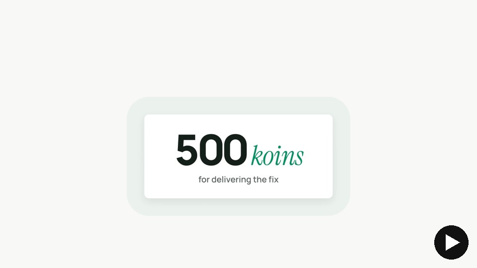</a><br><b>Editorial</b> · 28 s</td>
<td align="center"><a href="https://github.com/ishwarjha/motiontale/releases/download/examples/explainer.mp4">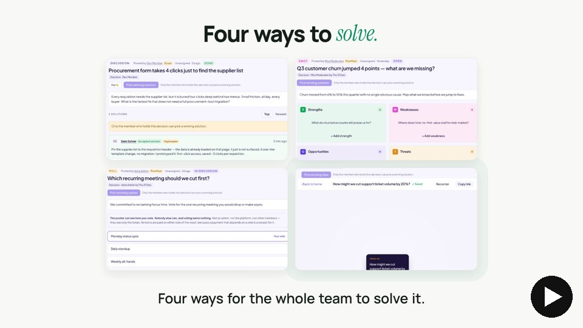</a><br><b>Explainer</b> · 60 s</td>
<td align="center"><a href="https://github.com/ishwarjha/motiontale/releases/download/examples/tour.mp4">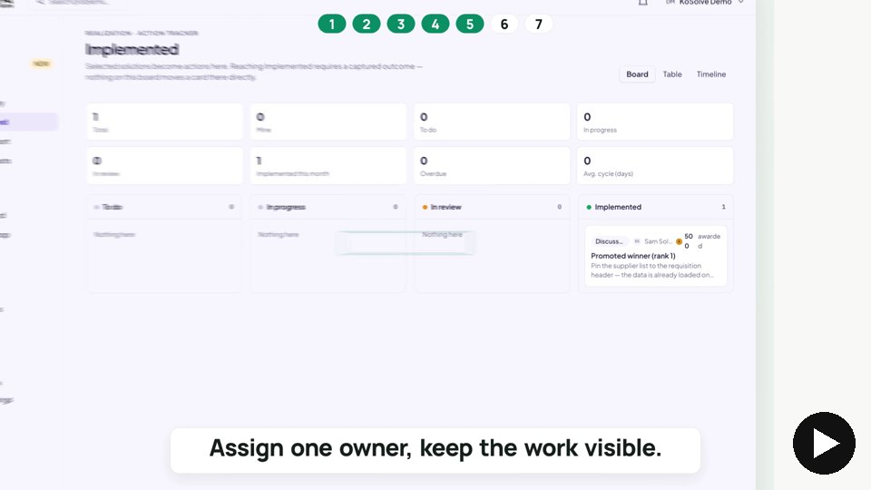</a><br><b>Product tour</b> · 56 s</td>
</tr>
<tr>
<td align="center"><a href="https://github.com/ishwarjha/motiontale/releases/download/examples/vertical.mp4">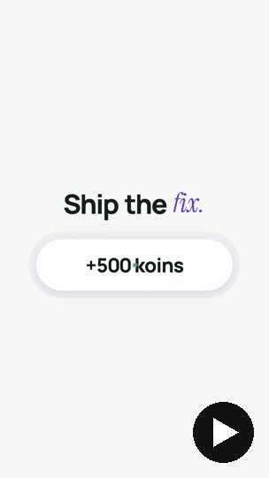</a><br><b>Vertical</b> · 20 s</td>
<td align="center"><a href="https://github.com/ishwarjha/motiontale/releases/download/examples/keynote.mp4">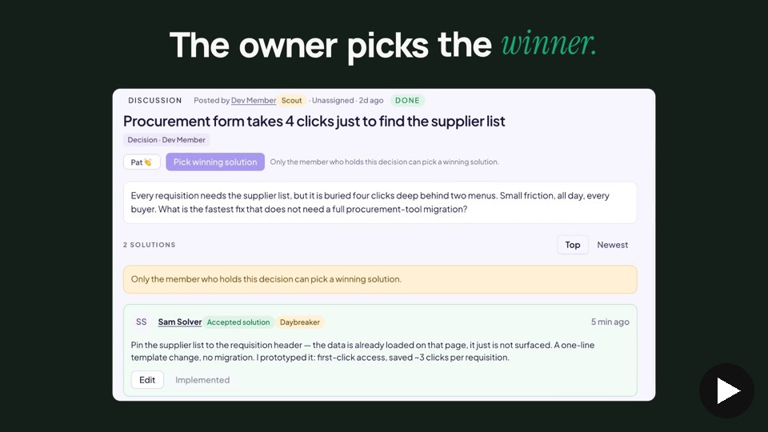</a><br><b>Keynote</b> · 28 s</td>
<td align="center"><a href="https://github.com/ishwarjha/motiontale/releases/download/examples/morph-loop.mp4">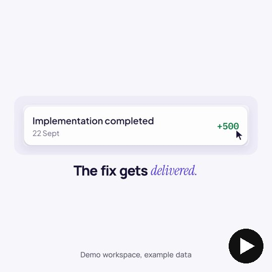</a><br><b>Morph loop</b> · 22 s</td>
</tr>
<tr>
<td align="center"><a href="https://github.com/ishwarjha/motiontale/releases/download/examples/story.mp4">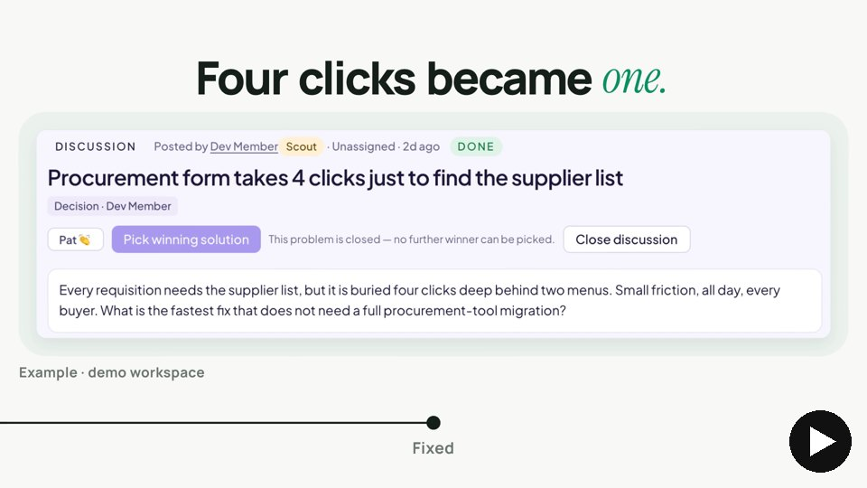</a><br><b>Story</b> · 46 s</td>
<td align="center"><a href="https://github.com/ishwarjha/motiontale/releases/download/examples/teaser.mp4">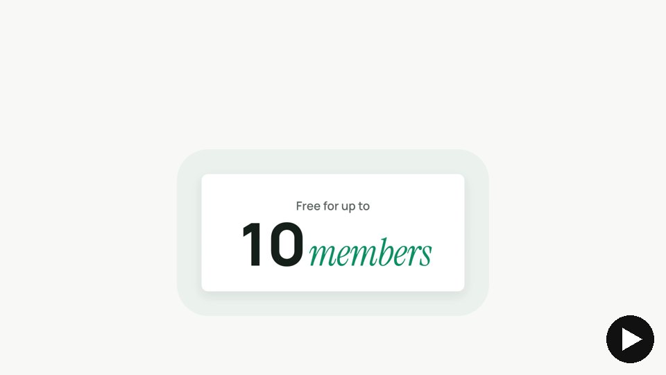</a><br><b>Teaser</b> · 14 s</td>
<td align="center"><a href="https://github.com/ishwarjha/motiontale/releases/download/examples/data-story.mp4">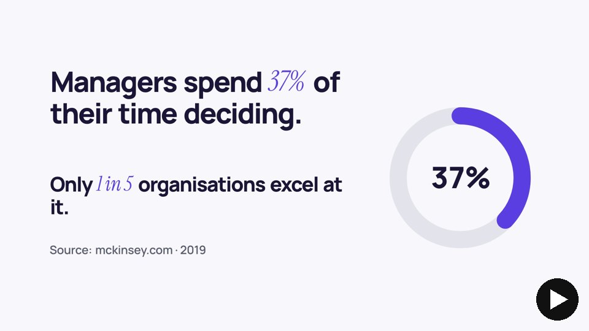</a><br><b>Data story</b> · 34 s</td>
</tr>
<tr>
<td align="center"><a href="https://github.com/ishwarjha/motiontale/releases/download/examples/tutorial.mp4">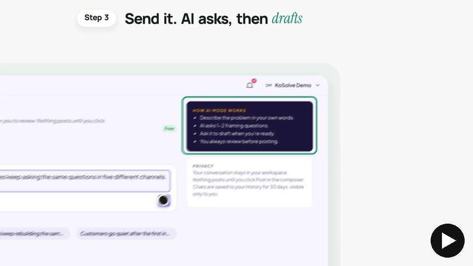</a><br><b>Tutorial</b> · 44 s</td>
<td align="center"><a href="https://github.com/ishwarjha/motiontale/releases/download/examples/app-preview.mp4">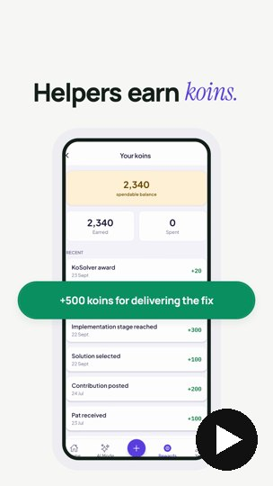</a><br><b>App preview</b> · 24 s</td>
<td align="center"><a href="https://github.com/ishwarjha/motiontale/releases/download/examples/sizzle-reel.mp4">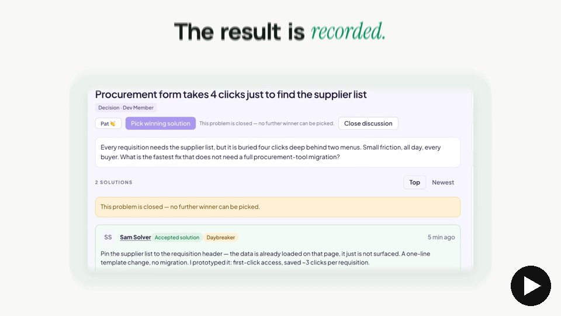</a><br><b>Sizzle reel</b> · 44 s</td>
</tr>
</table>

Need a style that isn't here? Adding one is a single file, described in [Extending it](#extending-it).

## How a video gets made

1. **You ask.** In plain words, in Claude Code or Codex: *"Make a 45-second launch film for our new reports page."*
2. **One round of questions.** What it is and who watches, the pain in your customer's words, three features and the payoff, the call to action, the style, formats and where it will be posted, any references, the voice, your logo, typefaces and colours, and the facts you want on screen with their sources. Anything your request already answered is skipped.
3. **You approve the shotlist.** Nothing is built before this.
4. **Your real screens are captured,** with a record of where each one came from.
5. **You approve four to six stills** from key moments. Nothing is fully rendered before this.
6. **The film is built, rendered and checked.** Problems the checks find are fixed before you see anything.
7. **You receive the film,** its other formats, captions, chapters, a poster frame and a GIF preview, with a short note of what was fixed, what could still improve, and which moments a person should listen to.

## Why the videos hold up

**Your product appears as itself.** Screens and single elements are captured from your live site or app, including the parts behind a login, using your own signed-in browser. While capturing, anything that could change your data is blocked. Nothing is redrawn or mocked up, and every captured image records where it came from.

**Numbers you can stand behind.** Every number, price, date or quote on screen needs a line in the film's `facts.md` with its source and date. Demo data is allowed only when it's labelled "Example" on screen, in the same card. A check reads every number in the video's text as it plays, so a figure can't slip in unsourced. Numbers inside your captured screens are your product's own; check those against `facts.md` by eye.

**Real sound, on the beat.** Music and effects are real recordings from a licensed library, each measured once so its loudest moment lands exactly on the event it belongs to. The music is cut so its drop lands on your payoff. A voice ducks the music. The mix aims for streaming loudness (-14 LUFS) without being squashed, and a check fails any video more than 1 LU off.

**Checked before you see it.** Up to fifteen checks run, depending on the video. Ten can fail the video: the page running without errors, readable text inside the frame, sourced numbers, the moments you said must happen, the same frame however it's rendered, no stray flashes or unplanned cuts, a clean loop seam, effects on their events, sound still in sync in the final file, and loudness. The rest are sheets and frames laid out for the agent to look at. Then a scored critique on eight axes (hook, readability, composition, motion, variety, brand, sound, polish): every score at 8 or more, or, after three rounds of fixes, a list of what's still below 8.

**Change it later, in seconds or minutes.** The film is kept as the code that draws it. A new number, a new line or a new screen is an edit and a re-render. A sound-only change swaps in without re-rendering the picture.

**One film, every format.** Wide, square and vertical versions come from the same timeline, laid out again for each shape rather than cropped.

## Quick start

You need Claude Code or Codex signed in, and ffmpeg (`brew install ffmpeg` on a Mac, `sudo apt install ffmpeg` on Debian or Ubuntu). We recommend [uv](https://docs.astral.sh/uv/), which installs the right Python for you; without it you need Python 3.12 or later.

**1. Add the plugin** (Claude Code shown; Codex below):

```bash
claude plugin marketplace add ishwarjha/motiontale
claude plugin install motiontale@motiontale
```

**2. Set up a workspace,** the folder your videos will live in. The easiest way: open Claude Code in that folder and say *"Set up Motiontale here."* Your agent runs the plugin's setup script for you.

Or run it yourself, from that folder:

```bash
mkdir -p ~/videos && cd ~/videos
bash "$(ls -d ~/.claude/plugins/cache/motiontale/motiontale/*/ | sort -V | tail -1)script/setup"
```

(If you cloned the repository instead, that's `bash <path to motiontale>/script/setup`.)

`script/setup` follows GitHub's [Scripts to Rule Them All](https://github.com/github/scripts-to-rule-them-all) convention. It calls `script/bootstrap`, which installs the engine's exact locked versions into `.venv` (with uv from `uv.lock`, or with pip from the same pinned list) and the Chromium the renderer draws with. Then it downloads and measures the sound library into `kit/`, copies `.env.example` to `.env` (readable only by you), and finishes with `doctor`, which shows what's connected. The first run takes a few minutes, mostly downloads. Running it again updates dependencies and fills in what's missing; it never overwrites your `.env` or sound library.

**3. Ask for a video.** Open Claude Code or Codex in the workspace and describe what you want. The prompts in [Ask for a video](#ask-for-a-video) show how to get the most from the first request.

Plugins can't run their own setup when you install them, and this one needs a Python environment, a browser and a sound library in the folder you choose, so setup is a separate, one-time step.

**Codex:** `codex plugin marketplace add <path to this folder or its git URL>`, then `codex plugin add motiontale@motiontale`, then copy `.codex/agents/*.toml` into `~/.codex/agents/` for the scene-builder and critic agents, and `AGENTS.md` into your workspace so Codex reads the rules. The session hook that points video requests at the skills is Claude Code only. Run `script/setup` yourself in a terminal (it downloads into caches outside the workspace, which Codex's sandbox doesn't allow). Rendering starts a headless browser, which Codex's default sandbox also blocks, so approve Codex's requests to run `film.py` outside the sandbox when it asks.

**Other agents:** the skills are plain Markdown and `AGENTS.md` carries the rules, so an agent that reads either can follow the same workflow. Claude Code and Codex are the two it has been tested with.

---

## Everything it does

### Capturing your product

| You can | How |
|---|---|
| Capture whole pages or single elements (a button, a card, a chart) | By page address and element, at twice screen resolution (three times for deep zooms); in your own Chrome, at that screen's resolution |
| Lift an element off its page so it can move on its own | A transparent crop: everything behind and around it is cleared |
| Show a state the app doesn't show on its own | A patch that fills a field, opens a menu or seeds demo data on the real page before the shot |
| Capture behind a login | Your own signed-in Chrome, started with remote debugging on port 9222 (capture works in a tab of its own and closes only that; writes are blocked in that browser while it runs, except from its own background service workers), or a saved sign-in session stored outside the video folder and readable only by you |
| Use screenshots from a phone, an emulator or a design review | Import them; each keeps its source, the part used and a fingerprint |
| Trust that nothing changes | While capturing, only read requests leave the browser (GET, HEAD, OPTIONS). Form posts, pop-up requests and messages the page sends over live connections are dropped, unless you allow writes for a demo account. In your own Chrome, its background service workers can't be blocked, so capture a demo account there |

Every captured image is recorded in `provenance.json` with its address, the element, any patch, the size and a fingerprint. If a film shows an image with no record, or one that changed since capture, the render is blocked.

### Facts and sources

- One `facts.md` per film: the claim as shown, its source, its date, and whether it's a real fact or labelled demo data.
- Capture suggests every number it sees on your screens, ready to confirm.
- Checked twice: once in the video's code before rendering, and again as it plays. Every quarter beat the check reads the text visible on screen, and input values, and fails on any number that stays there for 0.2 seconds without a `facts.md` row, or that comes from demo data with no Example label in its own card. Numbers inside captured screenshots aren't read; they're your product's own pixels.

### Music, effects and voice

- **The sound library** is a fixed set of real recordings from a free-to-use library: one music track (121 BPM; `kit.py` keeps a fallback track in case the first won't download) and eight effects (click, typing, whoosh, pop, ding, success, coins, impact), each measured for its tempo, beats, drop and peak, with its licence listed in `kit/AUDIO.md`. Adding a sound means adding it to `kit.py`'s list and rebuilding; a second music track, or one outside 110–125 BPM, needs a code change.
- **Timing:** effects land on their events by their measured peak; a click lands on the press, not the release, when it's marked to (the template does, and lint warns when it isn't); the music's drop lands on your payoff; a looping video's music runs straight through the seam.
- **Voice:** record it yourself, one take per scene, or choose an AI voice from Google, Microsoft or ElevenLabs, which is labelled as AI in the film's rules. Each take is transcribed and matched to the script, and fails if a number written in a sentence isn't heard in that sentence (or right at its edge) as the same complete spoken number. Then it's cut into sentences and placed on the beat grid. A pronunciation list handles names and acronyms.
- **Mix:** the music sits under the voice and comes up for the payoff; a short limiter takes at most 12 dB off the loudest peaks so plain gain can bring the mix to -14 LUFS, and the loudness check fails a file more than 1 LU off or with true peak above -1 dBTP. Music, effects and voice are also saved as separate stems.

### Motion and look

- Springs with a natural overshoot, one camera move at a time, and shapes that change into the next thing instead of cutting: a dot grows into a button, a button stretches into a card.
- Words rise one at a time out of a line; nothing fades in, blurs in or glows. Gradients on UI, 3D, particles and crossfades are ruled out by default.
- Motion blur measured frame by frame: 4 samples for still moments, up to 64 for fast ones.
- Two fonts bundled (Manrope and Instrument Serif, open licence) and a default palette; your brand's colours and fonts go in the film's rules file.

### The checks

| Check | What it proves |
|---|---|
| Layout | Text is large enough for a phone, inside the frame, not overlapping, with enough contrast, at every beat |
| Facts | Every number the frames show has a source, or an Example label in its card |
| Asserts | The moments you list happen, and the elements you name stay in frame |
| Determinism | Eight sampled moments render identically in any order |
| Pops | No whole-frame flashes and no cuts you didn't plan (a small flash in one corner can slip through) |
| Loop | A looping video has no visible seam |
| Peaks and sync | Every effect lands within 5 ms of its event, and within one frame in the final file; one too quiet to measure is flagged for a person to listen to |
| Loudness | -14 LUFS, true peak at or below -1 dBTP, a loudness range that survives a phone speaker |
| Contact sheet, phone sheet, first frame, poster, seams, loop replay | Laid out for the agent to look at, not just measure |

### Formats and delivery

- Wide (1920×1080), square (1080×1080), vertical (1080×1920) and the App Store's 886×1920, at 60 fps, H.264 with AAC sound.
- Captions as SRT and VTT, from the voice script, or from the video's caption list (the same list the video draws on screen).
- YouTube chapters, written only when YouTube will use them (three or more chapters, each at least 10 seconds).
- A poster frame at the payoff (or a moment you choose) and an 8-second GIF preview.
- A recipe for every full render of the main video; `replay` rebuilds it and compares every frame.

### Long films and teams of agents

Videos over about 90 seconds, or big enough to need several agents, get a director: saved progress with a gate at every step (your approval at the shotlist and the stills, checks for the rest), a render budget, and a clean resume after a crash or a usage limit. Scene-builder agents write their parts in parallel, and the director runs their renders one at a time. Every part passes a review against the shotlist, then a quality review by the critic agent.

### Reviews and audits

- **Review** a film's code against the rules before rendering, with every finding stated as a fix.
- **Audit** a whole workspace: rule breaks per video, videos older than their code, videos not checked since their last render, missing critique logs and recipes, kit sounds with no licence row, video copies of the engine that differ from it, screenshots nothing uses, and build folders over 50 MB, ranked by what blocks shipping.
- **Lint** runs before every render and blocks it on a rule break: an unsourced number it can read in the code (the facts check catches the rest on screen), a fade or glow, a timer, a missing capture record, or a music tempo that doesn't match the video's.

### Extending it

A new style is one file in `skills/motion-video/styles/`. A new scene technique is one file in `skills/motion-video/scenes/`, plus a helper in `engine/motion.js` if it needs one, used in the template video so the engine test covers it. The plugin's tests keep every file in shape.

---

## Ask for a video

The best first request answers what the one round of questions would ask:

1. What it is, in a few lines, who watches, and what they should believe and do afterwards.
2. The pain, in the words your customer would use.
3. Three features, in order, and the payoff: one real result or number, and whether everything on those screens can be shown publicly yet.
4. The call to action and the link.
5. The style, the length, the formats, and where it will be posted.
6. References: one to three videos or frames you like, and what you like about them.
7. The voice: none, your recording, or an AI voice.
8. Every number or quote you want on screen, with its source and date.
9. Your brand: the logo file, typefaces, colours and the tone it should carry.

Give numbers exactly as your source shows them. If you don't have a real number yet, say so; the video will label demo data "Example" rather than invent one.

Each prompt below is complete. Replace everything in angle brackets.

### Editorial

**Choose it when** the announcement itself is the story: a launch, a new homepage, a headline feature. Clean type, one accent word per line, the product doing the talking, music only.

```text
Make an editorial (Swiss style) launch video for <product>, 45 seconds, 16:9 first, then 1:1 and 9:16 laid out again from the same timeline.

What it is: <product> helps <who> <do what>. Viewers are <audience>, on <where it will be posted>; afterwards they should believe <one-line message> and <action>.
The pain, in the customer's words: "<pain line>". The first frame is the thumbnail: the pain line, fully on screen.
Features, in order: <feature 1>, <feature 2>, <feature 3>. The payoff: <result or number>, source <link or document, date>.
Call to action: "<CTA>", link <url>.

Capture from <url>, using my signed-in Chrome if it needs a login: the screen for each feature, and as transparent crops <the button, card or chip that should move on its own>. Patch in <any state the screen doesn't show by itself>.
Look: warm canvas, one serif-italic accent word per headline, real screens on white cards. Words rise one per beat; things change shape into the next thing, never cut or fade.
Sound: music only, the payoff on the drop, a click on every real press, a pop on everything that lands.
Facts: <each number or quote, with its source and date>.
References: <1–3 videos or frames you like>; take <the pacing, type or camera> from each, never the words or colours.
Brand: logo <file>, typefaces <names or files>, colours <hex values>, tone <calm | playful | urgent | premium | …>.
Deliver the wide film plus square and vertical versions, a poster at the payoff and a GIF preview. Every check passing and every critique score 8 or more, or tell me what's still below 8 after three rounds.
```

### Explainer

**Choose it when** someone needs to understand how it works before they buy: a sales page, a follow-up after a demo, a pitch. A voice tells the story and the real screens prove it.

```text
Make a 75-second explainer for <product>, 16:9 first, then 1:1.

Viewers are <buyers or users>, on <where it will be posted>. Afterwards they should believe <one-line message> and <book a demo, start a trial, reply>.
The problem, in the customer's words: "<pain line>". The first frame is the thumbnail: that line, fully on screen. What it costs them: <cost>, source <link, date>.
How it works, in three steps: <step 1>, <step 2>, <step 3>. The proof: <real result>, source <link or case study, date>.
Call to action: "<CTA>", link <url>.

Voice: <my recording: one take per scene | an AI voice from <Google, Microsoft or ElevenLabs> (<accent, pace, energy>), labelled as AI>. Write the script with one scene per step, then cut it and place it on the beat. Say numbers exactly as the script writes them; add pronunciations for <product name, acronyms>.
Capture from <url>: each step's screen, plus transparent crops of <the parts that should move>.
A title for each step. A stat card for each number, with the source under it. The music drops under the voice and comes back for the payoff.
References: <1–3 videos or frames you like>; take <the pacing, type or camera> from each, never the words or colours.
Brand: logo <file>, typefaces <names or files>, colours <hex values>, tone <calm | playful | urgent | premium | …>.
Deliver the wide and square films, captions, a poster at <the moment to show, or the payoff> and a GIF. Every check passing and every critique score 8 or more, or tell me what's still below 8 after three rounds.
```

### Product tour

**Choose it when** people need to learn the product, not just want it: onboarding, a help centre, a "see it in action" page. Chaptered, step by step, voiced.

```text
Make a product tour of <product>, about <5 minutes | 90 seconds>, 16:9.

Viewers are <new users | people evaluating it>, on <where it will be posted>. By the end they should know how to <main job> and <next step>.
The first frame is the thumbnail: the pain in one line, "<pain line>", fully on screen. Then a promise, "<promise>".
Chapters, each with a title: <1. step>, <2. step>, <3. step>, <…>. For each, show the real screen, zoom to the part that matters, and end on the result.
Capture every screen above from <url> with my signed-in Chrome, on a demo account, in the state each step reaches. Patch out any personal data rather than blurring it.
Voice: <my recording, one take per scene | an AI voice (<accent, pace, energy>), labelled as AI>, one scene per chapter. Pronunciations: <product name, acronyms>. Quiet music under the voice, no drop.
Call to action only at the end: "<CTA>", link <url>.
Facts: <any number shown, with its source and date>.
References: <1–3 videos or frames you like>; take <the pacing, type or camera> from each, never the words or colours.
Brand: logo <file>, typefaces <names or files>, colours <hex values>, tone <calm | playful | urgent | premium | …>.
Deliver the film with YouTube chapters, captions, a poster and a GIF.
```

### Vertical

**Choose it when** the video lives in a phone feed and most people watch without sound: Reels, Shorts, TikTok. Big words on the beat, one feature, and an ending that loops back to the start.

```text
Make a 20-second vertical video for <product>, 1080×1920, from the <video name> timeline if it exists, otherwise its own.

Viewers: <audience>, on <where it will be posted>; afterwards they should believe <one-line message> and <action>.
The first frame is the thumbnail: the pain as words, fully on screen: "<pain line>".
Then one feature: <feature>, on its real screen (captured from <url>, my signed-in Chrome if it needs a login, on a demo account) or as a shape changing from <shape> into <shape>.
Then the proof: <number>, source <link, date>. End card: "<CTA>", with <domain> as plain text (the link goes in the first comment), looping back into the first frame.
Headlines at least 96 px, nothing under the app's buttons and captions, readable with the sound off.
Sound: the music around its drop, so the proof lands on it. Nothing depends on hearing it.
References: <1–3 videos or frames you like>; take <the pacing, type or camera> from each, never the words or colours.
Brand: logo <file>, typefaces <names or files>, colours <hex values>, tone <calm | playful | urgent | premium | …>.
Facts: <each number, quote or name on screen, with its source and date>; anything without a source is shown labelled "Example".
Deliver the vertical video, a poster at <the moment to show, or the payoff> and a GIF. Check it on the phone sheet and watch the loop seam.
```

### Keynote

**Choose it when** the moment matters more than the details: an event opener, a major release, a pinned post. One statement at a time, slow and large, the product revealed on the drop.

```text
Make a 45-second keynote-style reveal of <product or release>, 16:9, then 1:1.

Viewers: <audience>, on <where it will be posted>; afterwards they should believe <one-line message> and <action>.
Open on the line people should remember, already on screen in the first frame: "<statement>". One statement per bar after that.
Build to the reveal: <what is revealed>, on one real screen, no cursor chasing. The proof on the drop: <number or result>, source <link, date>.
End card: "<CTA>", <url>.
Look: large type, flat contrast, no glows or light effects; dark only if the product itself is dark.
Capture <the screen or element to reveal> from <url> (my signed-in Chrome if it needs a login, on a demo account) as a transparent crop so it can rise on its own.
Sound: music and effects, no voice; one change per bar, the proof on the drop.
References: <1–3 videos or frames you like>; take <the pacing, type or camera> from each, never the words or colours.
Brand: logo <file>, typefaces <names or files>, colours <hex values>, tone <calm | playful | urgent | premium | …>.
Facts: <each number, quote or name on screen, with its source and date>; anything without a source is shown labelled "Example".
Deliver the wide and square films, a poster on the reveal and a GIF.
```

### Morph loop

**Choose it when** you want the whole product in one breath, playing on repeat: a social post, a homepage hero loop. One card changes shape through every state and ends where it began.

```text
Make a 20-second morph loop for <product>, 1:1 first, then 9:16 and 16:9.

Viewers: <audience>, on <where it will be posted>; afterwards they should believe <one-line message> and <action>.
Two bars of the pain in words: "<pain line>".
Then one card changes through these real states, one per bar: <state 1>, <state 2>, <state 3>, <state 4>, and the payoff <state 5> on the drop. Each state is a real capture; the card never cuts, it changes shape into the next.
The last state folds back into the first frame so the loop has no seam, and the music runs straight through it.
Capture each state from <url> (my signed-in Chrome if it needs a login, on a demo account), with transparent crops of <the elements that move>.
Something changes on every beat. No voice.
References: <1–3 videos or frames you like>; take <the pacing, type or camera> from each, never the words or colours.
Brand: logo <file>, typefaces <names or files>, colours <hex values>, tone <calm | playful | urgent | premium | …>.
Facts: <each number, quote or name on screen, with its source and date>; anything without a source is shown labelled "Example".
Deliver all three formats, a loop preview so I can watch the seam twice, and a GIF.
```

### Story

**Choose it when** there's a beginning, a turn and an end to tell: a brand film, an about page, how a problem came to be and what changed. A new image every few seconds, chapters that turn on the beat.

```text
Make a 90-second story video about <the story: how the problem began, what changed, where it is now>, <16:9 | 9:16>.

Viewers: <audience>, on <where it will be posted>; afterwards they should believe <one-line message> and <action>.
Open on the most striking image in the first two seconds: <image or line>.
Chapters, each with a title: <1. before>, <2. the turn>, <3. after>, <…>. A new image or payoff every three to five seconds.
Every date, name, quote and number needs a source: <each, with its source and date>. Quotes appear with who said them.
Capture <any product screens that appear> from <url> (my signed-in Chrome if it needs a login, on a demo account); everything else is type and shapes, never drawn product screens.
Voice: <none | my recording, one take per scene | an AI voice (<accent, pace, energy>), labelled as AI>; if voiced, pronunciations: <names, acronyms>. Chapter turns on the downbeat; the payoff, <what it is>, on the drop.
End card: "<CTA>", <url>.
References: <1–3 videos or frames you like>; take <the pacing, type or camera> from each, never the words or colours.
Brand: logo <file>, typefaces <names or files>, colours <hex values>, tone <calm | playful | urgent | premium | …>.
Deliver the video, captions if it's voiced, chapters if it runs long enough, a poster once the payoff has settled, and a GIF.
```

### Teaser

**Choose it when** you have one thing to say and a second to say it: a post that must stop the scroll, a changelog headline, the first reply under a launch. The payoff first, then the one action that got there.

```text
Make a 15-second teaser for <feature or release>, in 9:16 and 16:9 from one timeline.

Viewers: <audience>, on <where it will be posted>; afterwards they should believe <one-line message> and <action>.
The first frame is the payoff itself, fully on screen: "<payoff line>".
Then the one action that got there: <action> on the real screen, or a shape changing from <before> into <after>.
Then the proof: <number>, source <link, date>. End card: "<CTA>", <url>.
Capture <the screen and element for the action> from <url>, my signed-in Chrome if it needs a login, on a demo account.
Sound: the music, the proof on the drop, a click on the press.
The accent colour means the result, and nothing else.
References: <1–3 videos or frames you like>; take <the pacing, type or camera> from each, never the words or colours.
Brand: logo <file>, typefaces <names or files>, colours <hex values>, tone <calm | playful | urgent | premium | …>.
Facts: <each number, quote or name on screen, with its source and date>; anything without a source is shown labelled "Example".
Deliver both formats, a poster at <the moment to show, or the payoff> and a GIF.
```

### Data story

**Choose it when** the numbers are the news: a results announcement, a quarterly recap, a customer-impact reel. A headline makes the claim; the charts prove it.

```text
Make a 45-second data story, 16:9 first, then 1:1.

Viewers: <audience>, on <where it will be posted>; afterwards they should believe <one-line message> and <action>.
Open on a headline that states the claim in words, no number yet: "<claim>".
Then one chart per insight, two to four in all: <chart 1: what it shows, the values, source and date>, <chart 2: …>. Bars start from zero, scales follow the data's real range, lines draw themselves.
Take the values from <CSV or table>, each with its line in facts.md.
Then a stat card for each headline number, and the biggest one on the drop: <number>, source <link, date>.
End card: "<CTA>", <url>.
Voice: <none | my recording, one take per scene | an AI voice (<accent, pace, energy>), labelled as AI>; if voiced, pronunciations: <names, acronyms>.
References: <1–3 videos or frames you like>; take <the pacing, type or camera> from each, never the words or colours.
Brand: logo <file>, typefaces <names or files>, colours <hex values>, tone <calm | playful | urgent | premium | …>.
Deliver the wide and square films, a poster at <the moment to show, or the payoff> and a GIF. The facts check has to pass on every number the frames show.
```

### Tutorial

**Choose it when** someone needs to do a task, not hear about it: a help article, a feature how-to, a support reply. The finished result first, then each step on the real screen.

```text
Make a 60-second tutorial: "How to <task> in <product>", 16:9.

Viewers: <audience>, on <where it will be posted>; afterwards they should believe <one-line message> and <action>.
Open on the finished result for two seconds: <result screen>.
Steps, each with a numbered title held on screen: <Step 1: …>, <Step 2: …>, <Step 3: …>. For each, show the real screen before and after the click, and treat the screen change on each click as an intended cut.
Capture every before and after state from <url> with my signed-in Chrome, on a demo account. Where something is typed, reveal the real typed state with the typing sound.
Voice: <my recording, one take per scene | an AI voice (<accent, pace, energy>), labelled as AI>. Pronunciations: <product name, acronyms>. Captions always, from the same words the screen shows.
End card: the help link, <url>.
References: <1–3 videos or frames you like>; take <the pacing, type or camera> from each, never the words or colours.
Brand: logo <file>, typefaces <names or files>, colours <hex values>, tone <calm | playful | urgent | premium | …>.
Deliver the video, captions, a poster at <the moment to show, or the payoff> and a GIF.
```

### App preview

**Choose it when** the video sells an app on a phone: an App Store or Google Play preview, a mobile launch. Real phone screens and real taps.

```text
Make a 25-second app preview for <app>, 1080×1920 plus the App Store's 886×1920, then 16:9 with the phone beside the headline.

Viewers: <audience>, on <where it will be posted>; afterwards they should believe <one-line message> and <action>.
Open on the app's best screen with a headline above it: "<headline>".
Then taps and swipes on real screens: <screen 1, action, screen 2>, <…>. One screen becomes the next through a shared element; each tap's screen change is an intended cut.
Screens: <screenshots from my phone or an emulator in <folder>: import them with their source> or <capture <url> at phone size, signed in to a demo account>.
The proof on the drop: <rating or number>, source <store page or dashboard, date>.
End card: <the store's official badge, if I supply the file; otherwise the store's name as text>.
No voice. The music from the library.
References: <1–3 videos or frames you like>; take <the pacing, type or camera> from each, never the words or colours.
Brand: logo <file>, typefaces <names or files>, colours <hex values>, tone <calm | playful | urgent | premium | …>.
Facts: <each number, quote or name on screen, with its source and date>; anything without a source is shown labelled "Example".
Deliver both vertical sizes, the wide version, a poster at <the moment to show, or the payoff> and a GIF.
```

### Sizzle reel

**Choose it when** you want momentum and a room's attention: a launch-week or year-in-review recap, an investor or partner pitch opener, an event opener. The strongest moments, faster and faster, the biggest number on the drop.

```text
Make a 60-second sizzle reel of <this year's releases | launch week | the product>, 16:9 first, then 9:16.

Viewers: <audience>, on <where it will be posted>; afterwards they should believe <one-line message> and <action>.
Open on the strongest moment: <image or line>. Not the biggest number; that waits for the drop.
Highlights, one per bar and getting faster (four beats, then two, then one): <highlight 1, on its real screen>, <highlight 2>, <…>. Capture each screen from <url>, my signed-in Chrome if it needs a login, on a demo account. Each screen swaps while its card is smallest, so no cut shows.
A stat card for each real number: <number, source, date>, <…>. Quotes only with who said them and where: "<quote>", <name, publication, date>.
The biggest number on the drop, held for a full bar: <number>, source <link, date>.
End card: "<CTA>", <url>.
No voice. Music that builds.
References: <1–3 videos or frames you like>; take <the pacing, type or camera> from each, never the words or colours.
Brand: logo <file>, typefaces <names or files>, colours <hex values>, tone <calm | playful | urgent | premium | …>.
Deliver the wide and vertical versions, a poster at <the moment to show, or the payoff> and a GIF.
```

---

## Settings and keys

### What needs a key, and what doesn't

| You want to | What you need | Key? |
|---|---|---|
| Make videos with music, effects and captions | Claude Code or Codex, signed in | No |
| Narrate with your own voice | A recording per scene in the video's `vo/` folder | No |
| Narrate with an AI voice | An account with one voice provider (Google, Microsoft or ElevenLabs) | Yes: that provider's key, in `.env` |
| Run your AI agent on a server or in CI, where you can't sign in | An Anthropic or OpenAI API key | Yes: in the shell, never in `.env` |

Most people need no keys at all. Add one only when you want an AI voice.

### Quick setup

1. **Rename `.env.example` to `.env`.** Copy it from the plugin into your workspace (the folder that holds `kit/`), then rename the copy:
   ```bash
   cp <plugin>/.env.example .env      # run in your workspace
   ```
   Keep the plugin's own `.env.example`: Motiontale reads it to know which settings are allowed.
2. **Add your keys.** Open `.env`, set `VOICE_PROVIDER` to `google`, `microsoft` or `elevenlabs`, and paste that provider's keys after the `=` signs (guides below). Leave everything else as it is.
3. **Check it.**
   ```bash
   .venv/bin/python <plugin>/engine/film.py doctor
   ```
   A working setup looks like this (keys are never printed):
   ```text
   .env: /Users/you/videos/.env
   claude  logged in via claude.ai
   codex   logged in via ChatGPT
   voice   provider google (only used by voice.py --tts): GEMINI_API_KEY set
   kit     /Users/you/videos/kit/audio
   ```

### Every setting

All of these live in `.env`. Only the keys for the provider you choose are needed.

| Setting | Needed when | Default | What it does |
|---|---|---|---|
| `VOICE_PROVIDER` | You use an AI voice | `google` | Which provider speaks: `google`, `microsoft` or `elevenlabs` |
| `GEMINI_API_KEY` | Provider is `google` | none | Your Google AI Studio key |
| `GEMINI_TTS_VOICE` | Never (optional) | `Charon` | A prebuilt Gemini voice, such as Kore, Puck, Aoede or Fenrir |
| `GEMINI_TTS_MODEL` | Never (optional) | `gemini-3.8-flash-tts` | The Gemini speech model |
| `AZURE_SPEECH_KEY` | Provider is `microsoft` | none | KEY 1 from your Azure Speech resource |
| `AZURE_SPEECH_REGION` | Provider is `microsoft` | none | That resource's region, such as `westeurope` or `eastus` |
| `AZURE_TTS_VOICE` | Never (optional) | `en-US-AndrewNeural` | Any neural voice name from Azure's voice gallery |
| `ELEVENLABS_API_KEY` | Provider is `elevenlabs` | none | Your ElevenLabs API key |
| `ELEVENLABS_VOICE_ID` | Provider is `elevenlabs` | none | The ID of the voice to use |
| `ELEVENLABS_MODEL` | Never (optional) | `eleven_multilingual_v2` | The ElevenLabs speech model |
| `MOTION_KIT` | Your sound library isn't in a `kit/` folder at or above your videos | none | The path to the kit folder (the one holding `kit/AUDIO.md` and its `audio/` folder) |

### Connecting an AI voice

**Google (Gemini text-to-speech)**
1. Go to [Google AI Studio](https://aistudio.google.com) and sign in with your Google account.
2. Choose **Get API key**, then **Create API key**, and copy it.
3. In `.env`: `VOICE_PROVIDER=google` and `GEMINI_API_KEY=` followed by your key.

**Microsoft (Azure AI Speech)**
1. In the [Azure portal](https://portal.azure.com), create a **Speech** resource (search for "Speech" when creating a resource).
2. Open the resource and go to **Keys and Endpoint**.
3. Copy **KEY 1** and the **Location/Region**, written in lowercase letters and digits, such as `westeurope`.
4. In `.env`: `VOICE_PROVIDER=microsoft`, `AZURE_SPEECH_KEY=` your key, and `AZURE_SPEECH_REGION=` your region.

**ElevenLabs**
1. Sign in at [elevenlabs.io](https://elevenlabs.io), open **Developers** in the sidebar, then **API Keys**, and create a key.
2. For the voice: open **My Voices**, choose a voice's **More actions** (the three dots), then **Copy voice ID**.
3. In `.env`: `VOICE_PROVIDER=elevenlabs`, `ELEVENLABS_API_KEY=` your key, and `ELEVENLABS_VOICE_ID=` the voice ID.

**Using it.** Ask for an AI voice in your request ("narrate it with an AI voice from Google"), or run `voice.py cut <video> --tts`. The video's rules then record that the voice is AI. To give one video a different provider or voice, put `{"provider": "elevenlabs", "voice": "<voice id>"}` in that video's `vo/voice.json`.

**Cost.** Each provider bills its own API. A failed request is retried at most three times, waiting up to 60 seconds when the provider asks, because every try may be billed. Check your provider's pricing before narrating long videos.

### Signing in your AI agent

| Agent | Usual way, no key | On a server or in CI, with an API key |
|---|---|---|
| Claude Code | `claude auth login` | `export ANTHROPIC_API_KEY=...` in the shell that starts Claude Code. Create the key in the [Anthropic Console](https://console.anthropic.com) under API keys. |
| Codex | `codex login` | `printenv OPENAI_API_KEY \| codex login --with-api-key`. Create the key on the [OpenAI platform](https://platform.openai.com) under API keys. |

Agent keys never go in `.env`: Motiontale doesn't load them from it, and never needs them to make a video. Don't export an API key where you're already signed in, or the agent bills the key instead of your plan; `doctor` warns you when that happens.

### How settings are read

- **One file.** Only the `.env` in your workspace, the folder holding `kit/` (or the folder above `MOTION_KIT`). A `.env` in a parent folder is ignored.
- **Your shell wins.** A value already exported in your shell is used instead of the one in `.env`.
- **Only known settings.** Lines for settings that aren't in `.env.example` are ignored, as are blank values and agent keys.
- **Friendly syntax.** `export KEY=value`, values in matching quotes, and a `# comment` after a value all work.

### Keeping keys safe

- `.env` is listed in `.gitignore`. Don't remove it from there, and never paste a key into a prompt, a script or a screenshot.
- Make the file readable only by you: `chmod 600 .env`.
- `doctor` and every error message name a missing key, but never print a key's value.
- If a key was ever committed or shared, revoke it with the provider and create a new one.

### Troubleshooting

| You see | What it means | Fix |
|---|---|---|
| `.env: none found` in `doctor` | No `.env` next to your `kit/` folder | Rename your copy to exactly `.env`, in the folder that holds `kit/` |
| `--tts with this provider needs GEMINI_API_KEY in .env` (or another key) | The chosen provider's key is missing or blank | Add the key to `.env`, or change `VOICE_PROVIDER` to the provider you set up |
| `AZURE_SPEECH_REGION '...' is not a region name like westeurope` | The region isn't a plain region name | Use the lowercase name from Keys and Endpoint, such as `westeurope`, not a URL |
| `unknown voice provider '...'` | `VOICE_PROVIDER` is misspelled | Use `google`, `microsoft` or `elevenlabs` |
| `TTS: no response after 3 tries` | The provider is busy, rate-limiting you, or unreachable | Wait and try again; check your plan's limits |
| `TTS error 401: ...` or `TTS error 403: ...` | The key is wrong, expired, or lacks access | Create a new key and paste it again, with no spaces or quotes around it |
| `no local login` for claude or codex in `doctor` | The agent isn't signed in | Run `claude auth login` or `codex login` |
| `note: ... is exported in your shell; ... may bill it` | An API key is exported where you're also signed in | Remove the `export` line from your shell profile, unless you mean to bill the key |
| `kit     missing (engine/kit.py builds it)` in `doctor` | No sound library found | Run `kit.py` in your workspace, or set `MOTION_KIT` |

## Running it yourself

The skills run everything for you. To drive the engine by hand:

```bash
PY=.venv/bin/python; E=<plugin>/engine
$PY $E/film.py new myvideo --size 1080x1920                  # a new video folder, with fonts and rules
$PY $E/capture.py myvideo                                     # real screens, from myvideo/capture.json
$PY $E/capture.py import myvideo phone.png <source url>       # a screenshot taken elsewhere
python3 $E/lint.py myvideo                                    # rule breaks, blocking ones first
$PY $E/voice.py cut myvideo [--tts] && $PY $E/voice.py place myvideo   # script.md: "## 1. Title" then "**Voice:** ..."
$PY $E/film.py mix myvideo                                    # music, effects and voice into audio/mix.wav
$PY $E/film.py render myvideo --animatic                      # a fast, unblurred draft
$PY $E/film.py render myvideo                                 # the film (--from/--to for a part, --shutter 180 for crisper motion)
$PY $E/film.py check myvideo                                  # every check that applies (or name some)
$PY $E/film.py mux myvideo                                    # a new mix onto the last render, no re-render
SIZE=1080x1920 $PY $E/film.py render myvideo --out film_9x16.mp4
$PY $E/film.py frames myvideo 12 24.5                         # single frames at beats, for a close look
$PY $E/film.py export myvideo && $PY $E/film.py replay myvideo
$PY $E/film.py doctor                                         # sign-in, keys and sound library
python3 $E/audit.py .                                         # the whole workspace, ranked
```

## What it costs

A short video costs roughly **$4–6** in AI usage at API prices; a 60-second video with several scenes, around **$25–30**. On a Pro or Max plan it comes out of your normal usage, not a separate bill.

Setup is free and takes a few minutes the first time. The sound library is free. An AI voice, if you choose one, is billed by its provider.

*These are approximate, from our own test runs. Your actual cost may vary with the AI model you use, your pricing plan, the length of the video, product screens, voice, and how many rounds of changes it takes.*

## Limits worth knowing

- **Everything is type, shapes and your real captures.** There's no generated imagery and no stock footage, by design.
- **Rendering happens on your computer.** Measured on the Mac it was built on, with six render workers: a 60-second video took about four minutes and a 14-second one under a minute. A busier or smaller machine takes longer.
- **The voice check understands English,** and downloads its speech model (about 150 MB) the first time a voice is checked. On-screen text and captions can be any language the fonts cover; the transcript match that checks a recorded or AI voice is English only.
- **The sound library is small and fixed:** one music track (121 BPM, with a fallback listed in case it won't download) and eight effects. Styles that would suit a slower track use this one; a different track needs a code change in `kit.py`.
- **Phone screens come in as screenshots.** Capture works on web pages directly; for a native app, import screenshots from a phone or emulator.
- **Personal data is your call.** Capture a demo account, or patch personal details out on the page; nothing is blurred automatically.
- **Replay is nearly always exact.** Text the camera zooms into can come back an invisible fraction of a shade different, most often when six workers render at once on a busy machine; with one worker it has matched exactly.

## Questions

**Is this AI-generated video?**
No pixels are generated. Your agent writes the video as code, and the engine draws each frame from it. The same code produces the same video, down to invisible edge differences on text the camera zooms into.

**What does it cost?**
Roughly $4–6 for a short video and $25–30 for a 60-second one, at API prices; on a plan it comes out of your normal usage. See [What it costs](#what-it-costs). An AI voice is billed by its provider. The sound library is free to use under the licence listed for each file.

**How long does a video take?**
The render takes minutes. Most of the time goes into the questions and your two approvals, which is where the video gets good.

**Can it use our brand?**
Yes. Colours, fonts and the accent colour go in each video's rules file. The style cards give defaults, not requirements.

**Can I change a video later?**
Yes. Ask for the change; it's an edit and a new render. A change to the sound alone doesn't need a new render.

**Where do the files go?**
One folder per video in your workspace: the code, the captures, the facts, the sound and every delivered file.

**Does it post for me?**
No. You get the files; publishing stays with you.

---

## For contributors

```bash
python3 tests/test_plugin.py                 # the plugin's contract, a few seconds
.venv/bin/python engine/test_engine.py       # renders a video and plants a fault for each measured check, about five minutes
```

| Path | What's there |
|---|---|
| `skills/` | motion-brief, motion-capture, motion-video (styles, scenes, checks), motion-director, motion-check, motion-review, motion-audit, motion-extend |
| `engine/` | `film.py`, `capture.py`, `voice.py`, `kit.py`, `lint.py`, `audit.py`, `motion.js`, `render.py`, `audiokit.py`, `template/` |
| `agents/`, `.codex/agents/` | The scene builder and the critic, for Claude Code and Codex |
| `AGENTS.md` | The rules every agent follows |
| `script/` | `bootstrap` (installs the locked engine and its browser) and `setup` (prepares a workspace), in GitHub's Scripts to Rule Them All convention |
| `pyproject.toml`, `uv.lock` | The engine's dependencies, every version locked; `engine/requirements.txt` is the same list for pip |
| `docs/` | The plan, the issue log and the latest review |

**Shipping a change.** Installs are pinned to the plugin's version, so raise it (in `.claude-plugin/plugin.json`, `.codex-plugin/plugin.json` and `pyproject.toml`, kept equal by the tests) with every change users should get; otherwise `claude plugin update` reports "already at the latest version".

This repository is private. A licence will be added before it's published.
